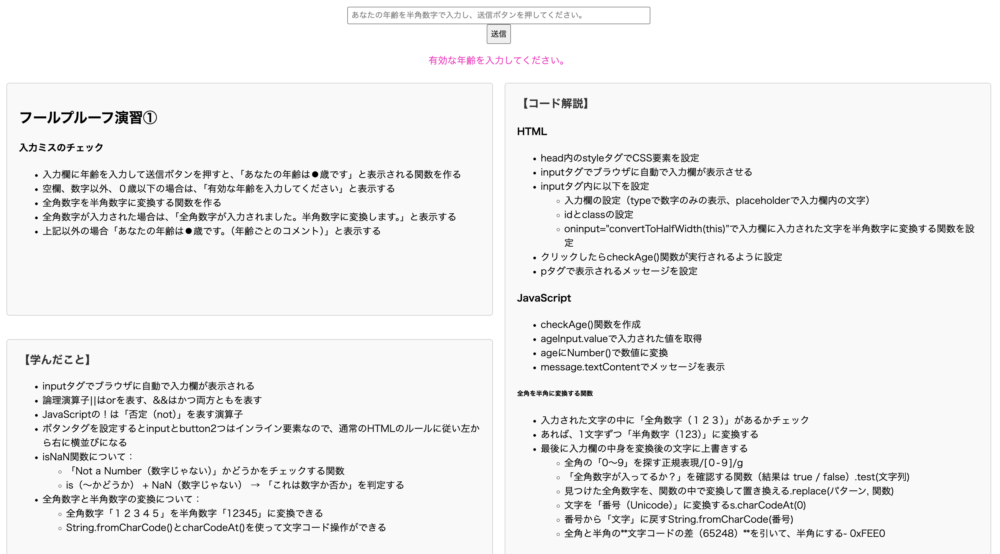
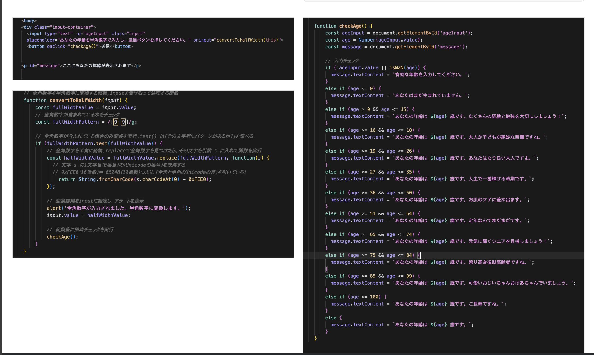

# フールプルーフ演習① 〜 年齢バリデーションフォーム 〜

## 概要  
ITパスポート試験対策で「フールプルーフ」という概念を学びましたが、イメージが曖昧だったため、理解を深めるためにJavaScriptを使って自ら実装を行いました。
実際に動かして体験することで、フールプルーフの重要性と具体的な実装方法について実感を持って学ぶことができました。

 
ChatGPTにサンプルコードを作ってもらい、コードの分析とデザインの調整を自分で行いました。
学んだ内容はHTML内にまとめ、振り返りやすく可視化しています。

 
また、「リファクタリング」という用語も学んだため、Cursor AIを活用してコードの整理や改善をしました。用語理解から実装・記録・改善まで、一連の学習として取り組んだ演習です。
  
## 完成画像

  
## 実装ページ  
🔗 [フールプルーフ演習①](https://study-web-y9ua.vercel.app/)

  

## 学んだこと  
- `input`要素の属性設定（`type="number"`, `placeholder`）
- `oninput`イベントでリアルタイム検証
- `value`, `isNaN()`, `!`演算子を使った入力チェック
- `if/else`で複数条件に応じた分岐処理
- `charCodeAt()`, `fromCharCode()` を使った全角→半角数字変換
- 文字コードの操作方法（全角と半角の差 65248）
- フールプルーフ設計の考え方と具体例
  

## エラー・調整とその解決  
| 問題 | 解決策 |
| --- | --- |
| 全角数字が入力されると無効になる | `charCodeAt()`と`fromCharCode()`で半角数字に変換して対応 |
| 数字以外の文字や空欄入力への対応 | `isNaN()`や`!value`でバリデーション実装 |
| 100歳以上でも正しいメッセージが表示されない | 境界値チェック（`age >= 100`）を追加し、条件を詳細化 |
| スマホ画面で入力欄が小さすぎる | メディアクエリでフォームサイズ・マージン調整 |
  

## 使った技術・ツール  
| 技術・ツール | 内容・目的 |
| ------------ | --------- |
| HTML / CSS   | フォーム要素の基本設計、レスポンシブ対応 |
| JavaScript   | 入力バリデーション、文字コード操作 |
| Vercel       | デプロイ、スマホ動作確認 |
| Cursor       | エディタ（GitHub連携）、開発環境（Mac）
  

## 今後の応用アイデア  
- 入力バリデーションを正規表現で強化
- エラーメッセージのデザイン改善（アクセシビリティ対応）
- 入力ミスがあった際にリアルタイムでガイドを表示
- ユーザーの年齢に応じた追加インタラクション（例：若年層は注意喚起、シニア層は称賛）
  

## 最終更新日  
2025/5/28
