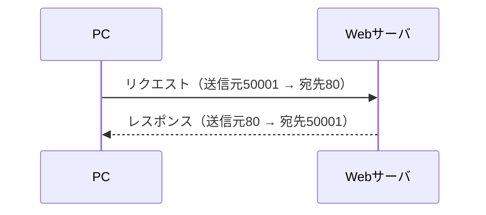
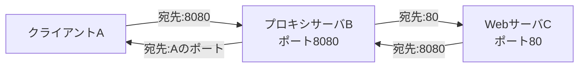

2025/9/18
# 🌐 ポート番号と通信フローの仕組み  
**過去問で出た“ポート番号の動き”がわかる！**

---

## 🎯 このページの目的
- 「送信元ポート」「宛先ポート」の意味がわかる
- HTTP通信の流れが理解できる
- プロキシを使うとポートの流れがどう変わるかがイメージできる
- **令和元年秋・令和4年サンプルの問題が自力で解けるようになる！**

---

## 🧩 ポート番号ってなに？
- 通信相手の“アプリケーションの入り口”を指定する番号
- IPアドレスが「住所」、ポート番号は「部屋番号」
- 代表的なポート番号：
  - HTTP：80
  - HTTPS：443
  - プロキシ：8080（よく使われる）

---

## 🚚 HTTP通信のポート番号の流れ（基本）

- PC側の送信元ポート（50001）は「エフェメラルポート（動的）」
- サーバ側は固定ポート（HTTPなら80）

✅ ポイント：**戻りのパケットは送信元・宛先が“反転”する**

---

## 🧪 過去問で確認①（令和4年サンプル問）

> PCがWebサーバにHTTPで接続。送信元ポートは50001。  
> 戻りのTCPパケットでの送信元・宛先は？

✅ 正解：**送信元80、宛先50001**

---

## 🛰 プロキシサーバを使うとどう変わる？

### 通信の流れ（A → B → C）

### TCPポート番号のまとめ：

| 区間             | 宛先ポート | 備考 |
|------------------|------------|------|
| A → B（プロキシ） | 8080       | プロキシBをターゲットにする |
| B → C（Web）      | 80         | WebサーバCに中継 |
| C → B（応答）     | 8080       | Bが受け取るため |
| B → A（応答）     | Aのポート（例：50001） | 最初の送信元ポートと一致 |

---

## 🧪 過去問で確認②（令和元年秋 問34）

> A → プロキシB（8080） → WebサーバC（80）  
> **「宛先ポート番号が常に8080になるTCPパケット」は？**

✅ 正解：**A→BへのHTTP要求、C→BへのHTTP応答**

---

## 🧠 まとめ

| ポイント | 内容 |
|----------|------|
| 宛先ポート | 通信の“入り口”を指定する番号 |
| 送信元ポート | クライアント側が一時的に使う番号（例：50001） |
| 戻りの通信 | ポート番号が“反転”する |
| プロキシ通信 | A→Bでは宛先ポートは8080（常に）になる |
| 試験の解法
